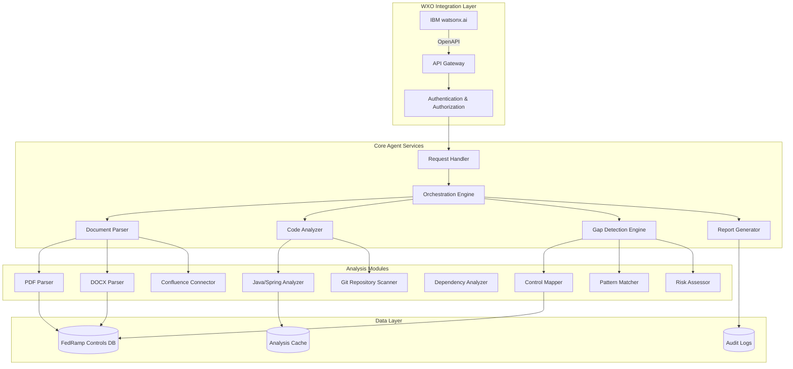
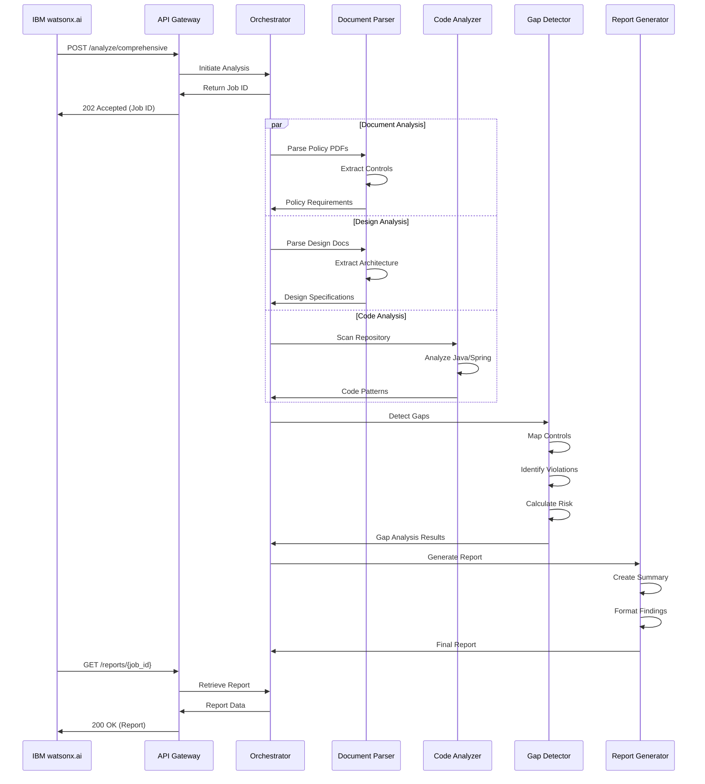
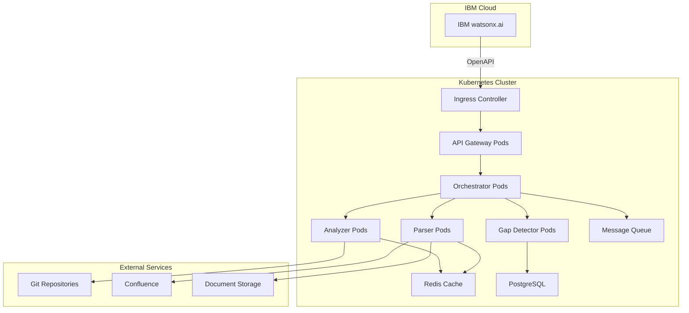

# FedRamp Gap Analysis Agent - Architecture Design

## Overview

The FedRamp Gap Analysis Agent is an AI-powered compliance analysis tool designed to integrate with IBM watsonx.ai through OpenAPI. It analyzes FedRamp policy documents, design documentation, and source code repositories to identify compliance gaps against FedRamp High baseline controls (NIST 800-53).

## System Architecture

## Component Breakdown

### 1. WXO Integration Layer

#### API Gateway

- **Purpose**: Expose agent capabilities via OpenAPI specification
- **Technology**: FastAPI (Python) or Spring Boot (Java)
- **Endpoints**:
  - `POST /api/v1/analyze/policy` - Analyze FedRamp policy documents
  - `POST /api/v1/analyze/design` - Analyze design documents
  - `POST /api/v1/analyze/code` - Analyze Git repository
  - `POST /api/v1/analyze/comprehensive` - Full gap analysis
  - `GET /api/v1/reports/{analysis_id}` - Retrieve analysis reports
  - `GET /api/v1/controls` - List FedRamp controls
  - `GET /api/v1/health` - Health check endpoint

#### Authentication & Authorization

- **Method**: OAuth 2.0 / IBM Cloud IAM
- **Features**:
  - API key validation
  - Role-based access control
  - Rate limiting
  - Audit logging

### 2. Core Agent Services

#### Request Handler

- Validates incoming requests
- Manages request queuing
- Handles async processing
- Returns job IDs for long-running tasks

#### Orchestration Engine

- Coordinates analysis workflow
- Manages parallel processing
- Handles error recovery
- Aggregates results from multiple analyzers

#### Document Parser

- **PDF Parser**: Extract text and structure from FedRamp policy PDFs
- **DOCX Parser**: Parse Word documents (design docs)
- **Confluence Connector**: Fetch and parse Confluence pages
- **Features**:
  - Table extraction
  - Section identification
  - Metadata extraction
  - OCR support for scanned documents

#### Code Analyzer

- **Java/Spring Analyzer**:
  - Security configuration analysis
  - Authentication/Authorization patterns
  - Logging and audit trail detection
  - Encryption usage verification
  - API security analysis
- **Git Repository Scanner**:
  - Clone and scan repositories
  - File pattern matching
  - Dependency analysis
  - Secret detection
  - Configuration file analysis

#### Gap Detection Engine

- **Control Mapper**: Maps code patterns to FedRamp controls
- **Pattern Matcher**: Identifies compliance patterns and anti-patterns
- **Risk Assessor**: Calculates risk scores for identified gaps
- **Features**:
  - NIST 800-53 control mapping
  - Severity classification (Critical, High, Medium, Low)
  - Remediation recommendations
  - False positive filtering

#### Report Generator

- Creates comprehensive gap analysis reports
- Generates executive summaries
- Produces detailed technical findings
- Exports in multiple formats (JSON, PDF, HTML, Excel)

### 3. Data Layer

#### FedRamp Controls Database

- **Content**:
  - NIST 800-53 Rev 5 controls
  - FedRamp High baseline requirements
  - Control implementation guidance
  - Common compliance patterns
- **Format**: JSON/YAML with structured metadata

#### Analysis Cache

- Stores intermediate analysis results
- Caches parsed documents
- Maintains code analysis artifacts
- Improves performance for repeated analyses

#### Audit Logs

- Tracks all analysis requests
- Records user actions
- Maintains compliance audit trail
- Supports forensic analysis

## FedRamp High Baseline Control Categories

The agent analyzes the following control families:

1. **Access Control (AC)** - 25 controls
2. **Awareness and Training (AT)** - 5 controls
3. **Audit and Accountability (AU)** - 12 controls
4. **Security Assessment and Authorization (CA)** - 9 controls
5. **Configuration Management (CM)** - 11 controls
6. **Contingency Planning (CP)** - 10 controls
7. **Identification and Authentication (IA)** - 11 controls
8. **Incident Response (IR)** - 10 controls
9. **Maintenance (MA)** - 6 controls
10. **Media Protection (MP)** - 8 controls
11. **Physical and Environmental Protection (PE)** - 20 controls
12. **Planning (PL)** - 9 controls
13. **Personnel Security (PS)** - 8 controls
14. **Risk Assessment (RA)** - 6 controls
15. **System and Services Acquisition (SA)** - 22 controls
16. **System and Communications Protection (SC)** - 45 controls
17. **System and Information Integrity (SI)** - 17 controls

## Analysis Workflow

## Technology Stack

### Backend

- **Language**: Python 3.11+ or Java 17+
- **Framework**: FastAPI (Python) or Spring Boot (Java)
- **API Documentation**: OpenAPI 3.1 / Swagger
- **Async Processing**: Celery (Python) or Spring Async (Java)
- **Message Queue**: Redis or RabbitMQ

### Document Processing

- **PDF**: PyPDF2, pdfplumber, or Apache PDFBox
- **DOCX**: python-docx or Apache POI
- **OCR**: Tesseract (if needed)

### Code Analysis

- **Java Parser**: JavaParser or Eclipse JDT
- **Static Analysis**: SonarQube API, SpotBugs
- **Git Integration**: GitPython or JGit
- **Dependency Analysis**: OWASP Dependency-Check

### AI/ML Components

- **NLP**: spaCy, transformers (for document understanding)
- **Pattern Matching**: Regular expressions, AST analysis
- **Similarity Detection**: sentence-transformers

### Database

- **Primary**: PostgreSQL (structured data)
- **Cache**: Redis (session and analysis cache)
- **Document Store**: MongoDB (optional, for unstructured data)

### Deployment

- **Containerization**: Docker
- **Orchestration**: Kubernetes
- **CI/CD**: Jenkins, GitLab CI, or GitHub Actions
- **Monitoring**: Prometheus, Grafana, ELK Stack

## Security Considerations

1. **Data Protection**
   - Encrypt sensitive data at rest and in transit
   - Secure credential management (HashiCorp Vault)
   - PII/PHI data handling compliance

2. **Access Control**
   - Multi-factor authentication
   - Role-based access control (RBAC)
   - API rate limiting and throttling

3. **Audit & Compliance**
   - Comprehensive audit logging
   - Tamper-proof log storage
   - Compliance reporting capabilities

4. **Code Security**
   - Input validation and sanitization
   - SQL injection prevention
   - XSS protection
   - Dependency vulnerability scanning

## Scalability & Performance

1. **Horizontal Scaling**
   - Stateless API design
   - Load balancing across multiple instances
   - Distributed task processing

2. **Caching Strategy**
   - Document parsing results cache
   - Control mapping cache
   - API response caching

3. **Optimization**
   - Parallel processing of independent analyses
   - Incremental code analysis (only changed files)
   - Lazy loading of large documents

## Integration Points

### IBM watsonx.ai Integration

- **Method**: OpenAPI specification
- **Authentication**: IBM Cloud IAM
- **Data Exchange**: JSON over HTTPS
- **Webhooks**: Status updates and completion notifications

### External Systems

- **Git Repositories**: GitHub, GitLab, Bitbucket
- **Document Management**: Confluence, SharePoint
- **Issue Tracking**: Jira (for gap remediation tracking)
- **SIEM**: Splunk, QRadar (for audit log integration)

## Deployment Architecture

## Next Steps

1. Implement core API endpoints with OpenAPI specification
2. Develop document parsing modules
3. Create Java/Spring Boot code analyzer
4. Build FedRamp control mapping database
5. Implement gap detection algorithms
6. Create comprehensive test suite
7. Deploy to IBM Cloud with watsonx.ai integration
8. Conduct security and performance testing
9. Create user documentation and training materials
