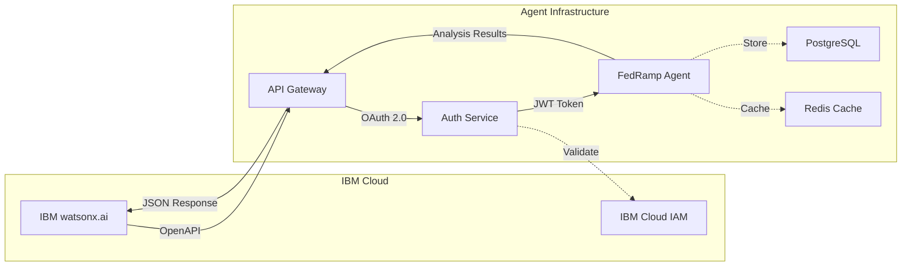

# IBM watsonx.ai Integration Guide for FedRamp Gap Analysis Agent

## Overview

This guide provides detailed instructions for integrating the FedRamp Gap Analysis Agent with IBM watsonx.ai using OpenAPI specifications. The integration enables watsonx.ai to orchestrate compliance analysis workflows and leverage the agent's capabilities through a standardized API interface.

## Integration Architecture



## Prerequisites

### IBM watsonx.ai Requirements

- IBM Cloud account with watsonx.ai access
- watsonx.ai project created
- API credentials (API key and project ID)
- OpenAPI tool integration enabled

### Agent Requirements

- FedRamp Gap Analysis Agent deployed and accessible
- Valid SSL/TLS certificate
- IBM Cloud IAM integration configured
- OpenAPI specification published

## OpenAPI Specification

### Complete OpenAPI 3.1 Specification

```yaml
openapi: 3.1.0
info:
  title: FedRamp Gap Analysis Agent API
  description: |
    AI-powered compliance analysis tool that identifies gaps between FedRamp policy 
    requirements, design documentation, and source code implementations.

    This API enables comprehensive analysis of:
    - FedRamp policy documents (PDF/DOCX)
    - System design documentation (Confluence/Word)
    - Java/Spring Boot source code repositories

    The agent maps findings to NIST 800-53 Rev 5 controls and FedRamp High baseline 
    requirements, providing detailed gap analysis with remediation recommendations.
  version: 1.0.0
  contact:
    name: FedRamp Gap Analysis Support
    email: support@example.com
    url: https://example.com/support
  license:
    name: Apache 2.0
    url: https://www.apache.org/licenses/LICENSE-2.0.html

servers:
  - url: https://api.fedramp-agent.example.com/api/v1
    description: Production server
  - url: https://staging-api.fedramp-agent.example.com/api/v1
    description: Staging server
  - url: http://localhost:8000/api/v1
    description: Local development server

security:
  - BearerAuth: []
  - ApiKeyAuth: []

tags:
  - name: Analysis
    description: Compliance analysis operations
  - name: Reports
    description: Report generation and retrieval
  - name: Controls
    description: FedRamp control information
  - name: Health
    description: Service health and status

paths:
  /analyze/comprehensive:
    post:
      tags:
        - Analysis
      summary: Perform comprehensive FedRamp gap analysis
      description: |
        Analyzes policy documents, design documentation, and source code to identify 
        compliance gaps against FedRamp High baseline controls. This is an asynchronous 
        operation that returns a job ID for status tracking.
      operationId: analyzeComprehensive
      requestBody:
        required: true
        content:
          application/json:
            schema:
              $ref: "#/components/schemas/ComprehensiveAnalysisRequest"
            examples:
              fullAnalysis:
                summary: Full analysis with all sources
                value:
                  policy_documents:
                    - url: "https://storage.example.com/policies/fedramp-policy.pdf"
                      type: "pdf"
                    - url: "https://storage.example.com/policies/security-plan.docx"
                      type: "docx"
                  design_documents:
                    - url: "https://confluence.example.com/pages/123456"
                      type: "confluence"
                    - url: "https://storage.example.com/design/architecture.docx"
                      type: "docx"
                  repository:
                    url: "https://github.com/example/secure-app.git"
                    branch: "main"
                    credentials:
                      type: "token"
                      token: "ghp_xxxxxxxxxxxx"
                  analysis_options:
                    control_families:
                      - "AC"
                      - "AU"
                      - "IA"
                      - "SC"
                    severity_threshold: "medium"
                    include_remediation: true
                  notification_webhook: "https://example.com/webhooks/analysis-complete"
      responses:
        "202":
          description: Analysis job accepted and queued
          content:
            application/json:
              schema:
                $ref: "#/components/schemas/AnalysisJobResponse"
              example:
                job_id: "job_abc123def456"
                status: "queued"
                created_at: "2026-02-06T08:00:00Z"
                estimated_completion: "2026-02-06T08:15:00Z"
                status_url: "/api/v1/jobs/job_abc123def456"
        "400":
          $ref: "#/components/responses/BadRequest"
        "401":
          $ref: "#/components/responses/Unauthorized"
        "429":
          $ref: "#/components/responses/RateLimitExceeded"

  /analyze/policy:
    post:
      tags:
        - Analysis
      summary: Analyze FedRamp policy documents
      description: Extracts and analyzes FedRamp policy requirements from PDF or DOCX documents
      operationId: analyzePolicy
      requestBody:
        required: true
        content:
          application/json:
            schema:
              $ref: "#/components/schemas/PolicyAnalysisRequest"
      responses:
        "202":
          description: Policy analysis job accepted
          content:
            application/json:
              schema:
                $ref: "#/components/schemas/AnalysisJobResponse"
        "400":
          $ref: "#/components/responses/BadRequest"
        "401":
          $ref: "#/components/responses/Unauthorized"

  /analyze/design:
    post:
      tags:
        - Analysis
      summary: Analyze design documents
      description: Analyzes system design documentation for compliance requirements
      operationId: analyzeDesign
      requestBody:
        required: true
        content:
          application/json:
            schema:
              $ref: "#/components/schemas/DesignAnalysisRequest"
      responses:
        "202":
          description: Design analysis job accepted
          content:
            application/json:
              schema:
                $ref: "#/components/schemas/AnalysisJobResponse"
        "400":
          $ref: "#/components/responses/BadRequest"
        "401":
          $ref: "#/components/responses/Unauthorized"

  /analyze/code:
    post:
      tags:
        - Analysis
      summary: Analyze source code repository
      description: Scans and analyzes Java/Spring Boot code for security and compliance patterns
      operationId: analyzeCode
      requestBody:
        required: true
        content:
          application/json:
            schema:
              $ref: "#/components/schemas/CodeAnalysisRequest"
      responses:
        "202":
          description: Code analysis job accepted
          content:
            application/json:
              schema:
                $ref: "#/components/schemas/AnalysisJobResponse"
        "400":
          $ref: "#/components/responses/BadRequest"
        "401":
          $ref: "#/components/responses/Unauthorized"

  /jobs/{job_id}:
    get:
      tags:
        - Analysis
      summary: Get analysis job status
      description: Retrieves the current status and progress of an analysis job
      operationId: getJobStatus
      parameters:
        - name: job_id
          in: path
          required: true
          schema:
            type: string
          description: Unique job identifier
      responses:
        "200":
          description: Job status retrieved successfully
          content:
            application/json:
              schema:
                $ref: "#/components/schemas/JobStatusResponse"
              example:
                job_id: "job_abc123def456"
                status: "completed"
                progress: 100
                created_at: "2026-02-06T08:00:00Z"
                started_at: "2026-02-06T08:00:05Z"
                completed_at: "2026-02-06T08:12:30Z"
                result:
                  report_id: "report_xyz789"
                  gaps_found: 23
                  critical_gaps: 3
                  high_gaps: 8
                  medium_gaps: 12
                  report_url: "/api/v1/reports/report_xyz789"
        "404":
          $ref: "#/components/responses/NotFound"

  /reports/{report_id}:
    get:
      tags:
        - Reports
      summary: Get analysis report
      description: Retrieves a complete analysis report in the specified format
      operationId: getReport
      parameters:
        - name: report_id
          in: path
          required: true
          schema:
            type: string
          description: Unique report identifier
        - name: format
          in: query
          schema:
            type: string
            enum: [json, pdf, html, excel]
            default: json
          description: Report output format
      responses:
        "200":
          description: Report retrieved successfully
          content:
            application/json:
              schema:
                $ref: "#/components/schemas/AnalysisReport"
            application/pdf:
              schema:
                type: string
                format: binary
            text/html:
              schema:
                type: string
            application/vnd.openxmlformats-officedocument.spreadsheetml.sheet:
              schema:
                type: string
                format: binary
        "404":
          $ref: "#/components/responses/NotFound"

  /controls:
    get:
      tags:
        - Controls
      summary: List FedRamp controls
      description: Retrieves a list of FedRamp High baseline controls
      operationId: listControls
      parameters:
        - name: family
          in: query
          schema:
            type: string
          description: Filter by control family (e.g., AC, AU, IA)
        - name: search
          in: query
          schema:
            type: string
          description: Search controls by keyword
        - name: page
          in: query
          schema:
            type: integer
            default: 1
          description: Page number for pagination
        - name: limit
          in: query
          schema:
            type: integer
            default: 50
            maximum: 100
          description: Number of results per page
      responses:
        "200":
          description: Controls retrieved successfully
          content:
            application/json:
              schema:
                $ref: "#/components/schemas/ControlListResponse"

  /controls/{control_id}:
    get:
      tags:
        - Controls
      summary: Get control details
      description: Retrieves detailed information about a specific FedRamp control
      operationId: getControl
      parameters:
        - name: control_id
          in: path
          required: true
          schema:
            type: string
          description: Control identifier (e.g., AC-2, AU-3)
      responses:
        "200":
          description: Control details retrieved successfully
          content:
            application/json:
              schema:
                $ref: "#/components/schemas/ControlDetail"
        "404":
          $ref: "#/components/responses/NotFound"

  /health:
    get:
      tags:
        - Health
      summary: Health check
      description: Returns the health status of the API service
      operationId: healthCheck
      security: []
      responses:
        "200":
          description: Service is healthy
          content:
            application/json:
              schema:
                $ref: "#/components/schemas/HealthResponse"
              example:
                status: "healthy"
                version: "1.0.0"
                timestamp: "2026-02-06T08:00:00Z"
                services:
                  database: "healthy"
                  cache: "healthy"
                  queue: "healthy"

components:
  securitySchemes:
    BearerAuth:
      type: http
      scheme: bearer
      bearerFormat: JWT
      description: IBM Cloud IAM JWT token
    ApiKeyAuth:
      type: apiKey
      in: header
      name: X-API-Key
      description: API key for authentication

  schemas:
    ComprehensiveAnalysisRequest:
      type: object
      required:
        - policy_documents
        - repository
      properties:
        policy_documents:
          type: array
          items:
            $ref: "#/components/schemas/DocumentReference"
          description: FedRamp policy documents to analyze
        design_documents:
          type: array
          items:
            $ref: "#/components/schemas/DocumentReference"
          description: Design documentation to analyze
        repository:
          $ref: "#/components/schemas/RepositoryReference"
        analysis_options:
          $ref: "#/components/schemas/AnalysisOptions"
        notification_webhook:
          type: string
          format: uri
          description: Webhook URL for completion notification

    DocumentReference:
      type: object
      required:
        - url
        - type
      properties:
        url:
          type: string
          format: uri
          description: Document URL or path
        type:
          type: string
          enum: [pdf, docx, confluence]
          description: Document type
        credentials:
          $ref: "#/components/schemas/Credentials"

    RepositoryReference:
      type: object
      required:
        - url
      properties:
        url:
          type: string
          format: uri
          description: Git repository URL
        branch:
          type: string
          default: main
          description: Branch to analyze
        commit:
          type: string
          description: Specific commit SHA (optional)
        credentials:
          $ref: "#/components/schemas/Credentials"

    Credentials:
      type: object
      required:
        - type
      properties:
        type:
          type: string
          enum: [token, basic, ssh]
        token:
          type: string
          description: Access token
        username:
          type: string
          description: Username for basic auth
        password:
          type: string
          format: password
          description: Password for basic auth
        ssh_key:
          type: string
          description: SSH private key

    AnalysisOptions:
      type: object
      properties:
        control_families:
          type: array
          items:
            type: string
          description: Specific control families to analyze
        severity_threshold:
          type: string
          enum: [low, medium, high, critical]
          default: medium
          description: Minimum severity level to report
        include_remediation:
          type: boolean
          default: true
          description: Include remediation recommendations
        max_findings:
          type: integer
          default: 1000
          description: Maximum number of findings to return

    PolicyAnalysisRequest:
      type: object
      required:
        - documents
      properties:
        documents:
          type: array
          items:
            $ref: "#/components/schemas/DocumentReference"

    DesignAnalysisRequest:
      type: object
      required:
        - documents
      properties:
        documents:
          type: array
          items:
            $ref: "#/components/schemas/DocumentReference"

    CodeAnalysisRequest:
      type: object
      required:
        - repository
      properties:
        repository:
          $ref: "#/components/schemas/RepositoryReference"
        analysis_options:
          $ref: "#/components/schemas/AnalysisOptions"

    AnalysisJobResponse:
      type: object
      properties:
        job_id:
          type: string
          description: Unique job identifier
        status:
          type: string
          enum: [queued, processing, completed, failed]
        created_at:
          type: string
          format: date-time
        estimated_completion:
          type: string
          format: date-time
        status_url:
          type: string
          format: uri

    JobStatusResponse:
      type: object
      properties:
        job_id:
          type: string
        status:
          type: string
          enum: [queued, processing, completed, failed, cancelled]
        progress:
          type: integer
          minimum: 0
          maximum: 100
        created_at:
          type: string
          format: date-time
        started_at:
          type: string
          format: date-time
        completed_at:
          type: string
          format: date-time
        error:
          type: string
          description: Error message if status is failed
        result:
          type: object
          properties:
            report_id:
              type: string
            gaps_found:
              type: integer
            critical_gaps:
              type: integer
            high_gaps:
              type: integer
            medium_gaps:
              type: integer
            low_gaps:
              type: integer
            report_url:
              type: string
              format: uri

    AnalysisReport:
      type: object
      properties:
        report_id:
          type: string
        generated_at:
          type: string
          format: date-time
        analysis_summary:
          $ref: "#/components/schemas/AnalysisSummary"
        gaps:
          type: array
          items:
            $ref: "#/components/schemas/Gap"
        control_coverage:
          $ref: "#/components/schemas/ControlCoverage"
        recommendations:
          type: array
          items:
            $ref: "#/components/schemas/Recommendation"

    AnalysisSummary:
      type: object
      properties:
        total_controls_evaluated:
          type: integer
        controls_compliant:
          type: integer
        controls_non_compliant:
          type: integer
        controls_partial:
          type: integer
        overall_compliance_score:
          type: number
          format: float
          minimum: 0
          maximum: 100
        risk_score:
          type: number
          format: float
          minimum: 0
          maximum: 10

    Gap:
      type: object
      properties:
        gap_id:
          type: string
        control_id:
          type: string
        control_name:
          type: string
        severity:
          type: string
          enum: [critical, high, medium, low]
        description:
          type: string
        evidence:
          type: array
          items:
            $ref: "#/components/schemas/Evidence"
        impact:
          type: string
        likelihood:
          type: string
        risk_score:
          type: number
        remediation:
          $ref: "#/components/schemas/Remediation"

    Evidence:
      type: object
      properties:
        source:
          type: string
          enum: [policy, design, code]
        location:
          type: string
        excerpt:
          type: string
        line_number:
          type: integer

    Remediation:
      type: object
      properties:
        recommendation:
          type: string
        implementation_steps:
          type: array
          items:
            type: string
        code_examples:
          type: array
          items:
            type: string
        references:
          type: array
          items:
            type: string
            format: uri
        estimated_effort:
          type: string
          enum: [low, medium, high]

    ControlCoverage:
      type: object
      properties:
        by_family:
          type: object
          additionalProperties:
            $ref: "#/components/schemas/FamilyCoverage"
        overall_coverage:
          type: number
          format: float
          minimum: 0
          maximum: 100

    FamilyCoverage:
      type: object
      properties:
        family_id:
          type: string
        family_name:
          type: string
        total_controls:
          type: integer
        compliant:
          type: integer
        non_compliant:
          type: integer
        partial:
          type: integer
        coverage_percentage:
          type: number
          format: float

    Recommendation:
      type: object
      properties:
        priority:
          type: string
          enum: [critical, high, medium, low]
        title:
          type: string
        description:
          type: string
        affected_controls:
          type: array
          items:
            type: string
        implementation_guidance:
          type: string

    ControlListResponse:
      type: object
      properties:
        controls:
          type: array
          items:
            $ref: "#/components/schemas/ControlSummary"
        pagination:
          $ref: "#/components/schemas/Pagination"

    ControlSummary:
      type: object
      properties:
        control_id:
          type: string
        control_name:
          type: string
        family:
          type: string
        baseline:
          type: string
          enum: [low, moderate, high]

    ControlDetail:
      type: object
      properties:
        control_id:
          type: string
        control_name:
          type: string
        family:
          type: string
        description:
          type: string
        implementation_guidance:
          type: string
        related_controls:
          type: array
          items:
            type: string
        assessment_procedures:
          type: string

    Pagination:
      type: object
      properties:
        page:
          type: integer
        limit:
          type: integer
        total_pages:
          type: integer
        total_items:
          type: integer

    HealthResponse:
      type: object
      properties:
        status:
          type: string
          enum: [healthy, degraded, unhealthy]
        version:
          type: string
        timestamp:
          type: string
          format: date-time
        services:
          type: object
          additionalProperties:
            type: string

    Error:
      type: object
      properties:
        error:
          type: string
        message:
          type: string
        details:
          type: object
        timestamp:
          type: string
          format: date-time

  responses:
    BadRequest:
      description: Invalid request parameters
      content:
        application/json:
          schema:
            $ref: "#/components/schemas/Error"
          example:
            error: "bad_request"
            message: "Invalid request parameters"
            details:
              field: "repository.url"
              issue: "Invalid URL format"
            timestamp: "2026-02-06T08:00:00Z"

    Unauthorized:
      description: Authentication required or failed
      content:
        application/json:
          schema:
            $ref: "#/components/schemas/Error"
          example:
            error: "unauthorized"
            message: "Invalid or expired authentication token"
            timestamp: "2026-02-06T08:00:00Z"

    NotFound:
      description: Resource not found
      content:
        application/json:
          schema:
            $ref: "#/components/schemas/Error"
          example:
            error: "not_found"
            message: "The requested resource was not found"
            timestamp: "2026-02-06T08:00:00Z"

    RateLimitExceeded:
      description: Rate limit exceeded
      content:
        application/json:
          schema:
            $ref: "#/components/schemas/Error"
          example:
            error: "rate_limit_exceeded"
            message: "Too many requests. Please try again later."
            details:
              retry_after: 60
            timestamp: "2026-02-06T08:00:00Z"
```

## Integration Steps

### Step 1: Configure IBM Cloud IAM

1. **Create Service ID**

```bash
ibmcloud iam service-id-create fedramp-agent-service \
  --description "Service ID for FedRamp Gap Analysis Agent"
```

2. **Create API Key**

```bash
ibmcloud iam service-api-key-create fedramp-agent-key \
  fedramp-agent-service \
  --description "API key for agent authentication"
```

3. **Assign Policies**

```bash
ibmcloud iam service-policy-create fedramp-agent-service \
  --roles Viewer,Reader \
  --service-name watsonx
```

### Step 2: Configure Agent for IBM Cloud

Create [`config/ibm_cloud.yaml`](cci:1://file:///c:/development/Tools/Training/FedRamp/config/ibm_cloud.yaml:0:0-0:0):

```yaml
ibm_cloud:
  iam:
    api_key: ${IBM_CLOUD_API_KEY}
    iam_url: https://iam.cloud.ibm.com
    token_endpoint: /identity/token
  watsonx:
    project_id: ${WATSONX_PROJECT_ID}
    region: us-south
    endpoint: https://us-south.ml.cloud.ibm.com
```

### Step 3: Register OpenAPI Spec in watsonx.ai

1. **Navigate to watsonx.ai Project**
   - Log in to IBM Cloud
   - Open your watsonx.ai project
   - Go to Tools → OpenAPI

2. **Import OpenAPI Specification**
   - Click "Add OpenAPI Tool"
   - Upload the OpenAPI YAML file
   - Configure authentication (Bearer token)
   - Test the connection

3. **Configure Tool Settings**
   - Set timeout: 300 seconds (for long-running analyses)
   - Enable webhooks for async operations
   - Configure retry policy

### Step 4: Create watsonx.ai Skills

Example skill for comprehensive analysis:

```python
# watsonx_skill_comprehensive_analysis.py
from ibm_watsonx_ai import APIClient
from ibm_watsonx_ai.foundation_models import Model

def create_fedramp_analysis_skill(api_client, project_id):
    """
    Create a watsonx.ai skill for FedRamp gap analysis
    """
    skill_definition = {
        "name": "FedRamp Comprehensive Gap Analysis",
        "description": "Analyzes policy, design, and code for FedRamp compliance gaps",
        "type": "openapi",
        "openapi_spec_url": "https://api.fedramp-agent.example.com/openapi.json",
        "authentication": {
            "type": "bearer",
            "token_source": "environment",
            "token_variable": "FEDRAMP_AGENT_TOKEN"
        },
        "operations": [
            {
                "operation_id": "analyzeComprehensive",
                "display_name": "Run Comprehensive Analysis",
                "description": "Perform full FedRamp gap analysis",
                "parameters": {
                    "policy_documents": {
                        "required": True,
                        "description": "List of policy document URLs"
                    },
                    "repository": {
                        "required": True,
                        "description": "Git repository information"
                    }
                }
            },
            {
                "operation_id": "getReport",
                "display_name": "Get Analysis Report",
                "description": "Retrieve analysis report",
                "parameters": {
                    "report_id": {
                        "required": True,
                        "description": "Report identifier"
                    },
                    "format": {
                        "required": False,
                        "default": "json",
                        "description": "Report format"
                    }
                }
            }
        ]
    }

    # Create skill in watsonx.ai
    skill = api_client.skills.create(
        project_id=project_id,
        skill_definition=skill_definition
    )

    return skill
```

### Step 5: Create Orchestration Workflow

Example watsonx.ai orchestration:

```python
# watsonx_orchestration_example.py
from ibm_watsonx_ai import APIClient, Credentials

# Initialize client
credentials = Credentials(
    api_key="YOUR_IBM_CLOUD_API_KEY",
    url="https://us-south.ml.cloud.ibm.com"
)
client = APIClient(credentials)

# Define orchestration workflow
workflow = {
    "name": "FedRamp Compliance Check Workflow",
    "steps": [
        {
            "id": "analyze",
            "type": "skill",
            "skill_name": "FedRamp Comprehensive Gap Analysis",
            "operation": "analyzeComprehensive",
            "inputs": {
                "policy_documents": [
                    {
                        "url": "{{policy_doc_url}}",
                        "type": "pdf"
                    }
                ],
                "repository": {
                    "url": "{{repo_url}}",
                    "branch": "main",
                    "credentials": {
                        "type": "token",
                        "token": "{{git_token}}"
                    }
                },
                "analysis_options": {
                    "control_families": ["AC", "AU", "IA", "SC"],
                    "include_remediation": True
                }
            },
            "outputs": {
                "job_id": "$.job_id"
            }
        },
        {
            "id": "wait_for_completion",
            "type": "wait",
            "condition": {
                "skill_name": "FedRamp Comprehensive Gap Analysis",
                "operation": "getJobStatus",
                "inputs": {
                    "job_id": "{{steps.analyze.outputs.job_id}}"
                },
                "until": "$.status == 'completed'",
                "max_wait": 900,
                "poll_interval": 30
            }
        },
        {
            "id": "get_report",
            "type": "skill",
            "skill_name": "FedRamp Comprehensive Gap Analysis",
            "operation": "getReport",
            "inputs": {
                "report_id": "{{steps.wait_for_completion.outputs.result.report_id}}",
                "format": "json"
            },
            "outputs": {
                "report": "$"
            }
        },
        {
            "id": "summarize",
            "type": "llm",
            "model": "ibm/granite-13b-chat-v2",
            "prompt": """
            Analyze the following FedRamp gap analysis report and provide:
            1. Executive summary of findings
            2. Top 5 critical gaps requiring immediate attention
            3. Recommended prioritization for remediation

            Report: {{steps.get_report.outputs.report}}
            """,
            "parameters": {
                "max_new_tokens": 1000,
                "temperature": 0.3
            }
        }
    ]
}

# Create workflow
workflow_id = client.workflows.create(
    project_id="YOUR_PROJECT_ID",
    workflow_definition=workflow
)

print(f"Workflow created: {workflow_id}")
```

### Step 6: Test Integration

```python
# test_integration.py
import requests
import time

# Configuration
API_BASE_URL = "https://api.fedramp-agent.example.com/api/v1"
API_KEY = "your-api-key"

headers = {
    "Authorization": f"Bearer {API_KEY}",
    "Content-Type": "application/json"
}

# Test 1: Health Check
response = requests.get(f"{API_BASE_URL}/health")
print(f"Health Check: {response.json()}")

# Test 2: Start Analysis
analysis_request = {
    "policy_documents": [
        {
            "url": "https://example.com/policy.pdf",
            "type": "pdf"
        }
    ],
    "repository": {
        "url": "https://github.com/example/repo.git",
        "branch": "main",
        "credentials": {
            "type": "token",
            "token": "ghp_xxxx"
        }
    },
    "analysis_options": {
        "control_families": ["AC", "AU"],
        "include_remediation": True
    }
}

response = requests.post(
    f"{API_BASE_URL}/analyze/comprehensive",
    headers=headers,
    json=analysis_request
)
job_data = response.json()
job_id = job_data["job_id"]
print(f"Analysis started: {job_id}")

# Test 3: Poll for Completion
while True:
    response = requests.get(
        f"{API_BASE_URL}/jobs/{job_id}",
        headers=headers
    )
    status_data = response.json()
    status = status_data["status"]
    progress = status_data.get("progress", 0)

    print(f"Status: {status}, Progress: {progress}%")

    if status == "completed":
        report_id = status_data["result"]["report_id"]
        break
    elif status == "failed":
        print(f"Analysis failed: {status_data.get('error')}")
        exit(1)

    time.sleep(10)

# Test 4: Get Report
response = requests.get(
    f"{API_BASE_URL}/reports/{report_id}",
    headers=headers,
    params={"format": "json"}
)
report = response.json()
print(f"Report retrieved: {report['report_id']}")
print(f"Gaps found: {report['analysis_summary']['total_controls_evaluated']}")
```

## Webhook Configuration

For async notifications, configure webhooks:

```python
# webhook_handler.py
from fastapi import FastAPI, Request
from pydantic import BaseModel

app = FastAPI()

class AnalysisCompleteWebhook(BaseModel):
    job_id: str
    status: str
    report_id: str
    gaps_found: int
    timestamp: str

@app.post("/webhooks/analysis-complete")
async def handle_analysis_complete(webhook: AnalysisCompleteWebhook):
    """
    Handle analysis completion webhook from FedRamp agent
    """
    print(f"Analysis {webhook.job_id} completed")
    print(f"Report ID: {webhook.report_id}")
    print(f"Gaps found: {webhook.gaps_found}")

    # Trigger watsonx.ai workflow continuation
    # or send notification to users

    return {"status": "received"}
```

## Best Practices

### 1. Authentication & Security

- Use IBM Cloud IAM tokens with short expiration
- Rotate API keys regularly
- Store credentials in IBM Cloud Secrets Manager
- Enable audit logging for all API calls

### 2. Error Handling

- Implement exponential backoff for retries
- Handle rate limiting gracefully
- Log all errors with context
- Provide meaningful error messages

### 3. Performance Optimization

- Use async operations for long-running analyses
- Implement caching for frequently accessed data
- Batch multiple analyses when possible
- Monitor API response times

### 4. Monitoring & Observability

- Track API usage metrics
- Monitor job completion rates
- Set up alerts for failures
- Log all integration events

## Troubleshooting

### Common Issues

**Issue: Authentication Failed**

```
Error: 401 Unauthorized
Solution: Verify IBM Cloud IAM token is valid and not expired
```

**Issue: Analysis Timeout**

```
Error: Job stuck in 'processing' status
Solution: Check webhook configuration and increase timeout settings
```

**Issue: Rate Limit Exceeded**

```
Error: 429 Too Many Requests
Solution: Implement request throttling and retry with exponential backoff
```

## Support & Resources

- **API Documentation**: https://api.fedramp-agent.example.com/docs
- **IBM watsonx.ai Docs**: https://cloud.ibm.com/docs/watsonx
- **Support Email**: support@example.com
- **GitHub Issues**: https://github.com/example/fedramp-agent/issues

## Next Steps

1. Deploy the FedRamp Gap Analysis Agent
2. Configure IBM Cloud IAM authentication
3. Register OpenAPI specification in watsonx.ai
4. Create and test orchestration workflows
5. Monitor integration performance
6. Gather user feedback and iterate
